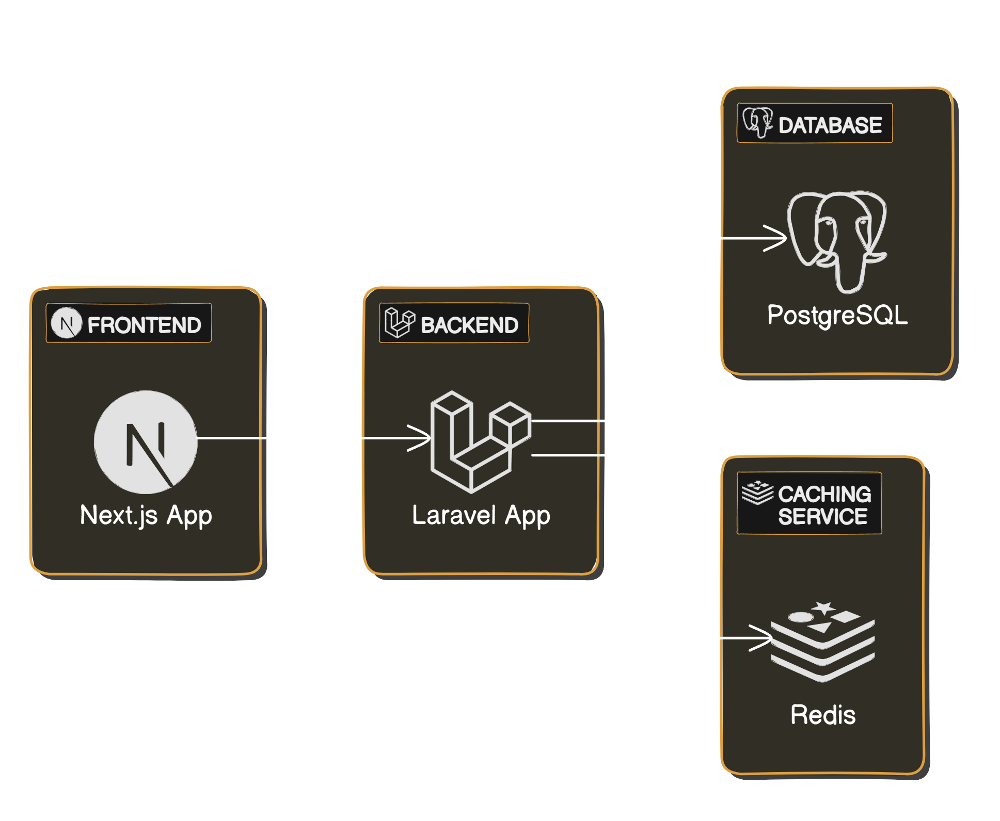

# Pets Application Store



## Client

- File system 
```
/client
├── components                # Componentes reutilizables de la UI
├── modules                   # Módulos funcionales de la aplicación
│   ├── products              # Módulo de Productos
│   │   ├── components        # Componentes específicos del módulo
│   │   ├── pages             # Páginas específicas del módulo
│   │   ├── services          # Servicios para consumir APIs
│   │   ├── hooks               # Hooks específicos del módulo
│   │   └── utils             # Utilidades específicas del módulo
│   │
│   ├── orders                # Módulo de Pedidos
│   │   ├── components
│   │   ├── pages
│   │   ├── hooks
│   │   ├── services
│   │   └── utils
│   │
│   └── users                 # Módulo de Usuarios
│       ├── components
│       ├── pages
│       ├── hooks
│       ├── services
│       └── utils
│
├── src
│   ├── api                   # Configuración de Axios
│   ├── assets                # Archivos estáticos
│   ├── config                # Configuración de la aplicación
│   └── utils                 # Utilidades y helpers generales
│   └── app                  # Configuración de la aplicación
│
├── public                    # Archivos estáticos públicos
├── styles                    # Archivos de estilo global
└── utils                     # Utilidades y helpers generales
```

## Server

- File system 
```
/backend
├── app
│   ├── Core                  # Núcleo común de la aplicación (abstracciones, interfaces, etc.)
│   │   ├── Contracts         # Interfaces generales
│   │   ├── Exceptions        # Excepciones personalizadas
│   │   ├── Providers         # Proveedores de servicios comunes
│   │   └── Events            # Eventos comunes de la aplicación
│   │
│   ├── Modules               # Módulos funcionales
│   │   ├── Products          # Módulo de Productos
│   │   │   ├── Controllers   # Controladores específicos del módulo
│   │   │   ├── Models        # Modelos específicos del módulo
│   │   │   ├── Services      # Lógica de negocio
│   │   │   ├── Repositories  # Repositorios para acceso a datos
│   │   │   ├── Events        # Eventos específicos del módulo
│   │   │   └── Listeners     # Escuchadores de eventos
│   │   │
│   │   ├── Orders            # Módulo de Pedidos
│   │   │   ├── Controllers
│   │   │   ├── Models
│   │   │   ├── Services
│   │   │   ├── Repositories
│   │   │   ├── Events
│   │   │   └── Listeners
│   │   │
│   │   └── Users             # Módulo de Usuarios
│   │       ├── Controllers
│   │       ├── Models
│   │       ├── Services
│   │       ├── Repositories
│   │       ├── Events
│   │       └── Listeners
│   │
│   └── Shared                # Código compartido entre módulos
│       ├── Traits            # Traits reutilizables
│       ├── ValueObjects      # Objetos de valor
│       └── DTOs              # Objetos de transferencia de datos
│
├── bootstrap                 # Bootstrap para el arranque de la aplicación
├── config                    # Configuración general de la aplicación
├── database                  # Migraciones, fábricas y seeders
├── routes                    # Definición de rutas
│   ├── api.php               # Rutas de la API
│   └── web.php               # Rutas web
├── storage                   # Almacenamiento de logs, caché, etc.
└── tests                     # Pruebas unitarias y funcionales
```
## This project uses

- Backend: Laravel (PHP) with DDD Modular Architecture.
- Frontend: React with Next.js.
- Mensajería/Eventos: Laravel Echo and Pusher for real-time updates.
- Imágenes/Media: Cloudinary for image storage.
- Data Base: PostgreSQL.
- Cache: Redis for cache.
- Autenticación: Laravel Passport or Sanctum for API authentication.

